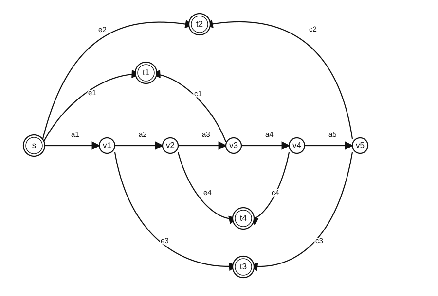

# The Exact Two-Scenario Cost-Nonincrease Supremum on the Four-Terminal Gadget

**Status:** public unrefereed theorem package, first released in `v0.2.0` and
carried forward mathematically unchanged in `v0.2.1`. Two role-separated
AI-assisted hostile critique rounds found no remaining theorem-level gap after
local repairs; they are not external human mathematical review. The
human-readable proof is authoritative and is accompanied by an exact rational
extremizing sequence, a graph-native finite certificate, and finite regression
checks. `v0.2.1` corrects provenance, status, and release hygiene only.

## 1. The graph, paths, and flow model

Let the directed graph have source `s`, trunk vertices `v1,...,v5`, terminals
`t1,...,t4`, and trunk arcs

\[
a_1=sv_1,
\quad a_2=v_1v_2,
\quad a_3=v_2v_3,
\quad a_4=v_3v_4,
\quad a_5=v_4v_5.
\]

The eight terminal arcs are

\[
e_1=st_1,
\ c_1=v_3t_1,
\ e_2=st_2,
\ c_2=v_5t_2,
\ e_3=v_1t_3,
\ c_3=v_5t_3,
\ e_4=v_2t_4,
\ c_4=v_4t_4.
\]

Each terminal has exactly the following two designated source-terminal paths:

| terminal `i` | path `E_i` | path `C_i` |
| ---: | --- | --- |
| 1 | `e1` | `a1 a2 a3 c1` |
| 2 | `e2` | `a1 a2 a3 a4 a5 c2` |
| 3 | `a1 e3` | `a1 a2 a3 a4 a5 c3` |
| 4 | `a1 a2 e4` | `a1 a2 a3 a4 c4` |

Terminal `i` has demand \(d_i>0\). A fractional flow sends proportion
\(p_i\in[0,1]\) on `C_i` and

\[
q_i:=1-p_i
\]

on `E_i`. With \(\mathbf 1_P(a)\) denoting arc membership in path `P`, its
arc load is

\[
x(a)=\sum_{i=1}^4 d_i
\bigl(p_i\mathbf 1_{C_i}(a)+q_i\mathbf 1_{E_i}(a)\bigr).
\tag{1}
\]

An unsplittable routing is described by its E-set
\(R\subseteq[4]\): terminals in `R` use `E`, and the others use `C`. Its load
is

\[
y^R(a)=
\sum_{i\notin R}d_i\mathbf 1_{C_i}(a)
+
\sum_{i\in R}d_i\mathbf 1_{E_i}(a).
\tag{2}
\]

## 2. Scenario-wise cost non-increase

For scenario \(j\in\{1,2\}\), let \(c_a^{(j)}\ge0\) be the per-unit arc cost.
Write

\[
\gamma_{i,C}^{(j)}
:=d_i\sum_{a\in C_i}c_a^{(j)},
\qquad
\gamma_{i,E}^{(j)}
:=d_i\sum_{a\in E_i}c_a^{(j)},
\]

and assume the full-demand E-minus-C differences are strictly positive:

\[
k_i^{(j)}
:=\gamma_{i,E}^{(j)}-\gamma_{i,C}^{(j)}>0.
\tag{3}
\]

Conversely, every positive difference vector is realizable on this graph: put
per-unit cost \(k_i^{(j)}/d_i\) on the private E-only arc `e_i` and zero on
every other arc. Thus optimizing over positive difference vectors is equivalent
to optimizing over legal nonnegative scenario arc costs of this form.

Let \(C_j(z)=\sum_a c_a^{(j)}z(a)\). Direct expansion gives

\[
\begin{aligned}
C_j(y^R)-C_j(x)
&=\sum_{i\in R}k_i^{(j)}-\sum_iq_i k_i^{(j)}\\
&=k^{(j)}(R)-k^{(j)}\!\cdot q.
\end{aligned}
\tag{4}
\]

Accordingly, a routing is **scenario-wise cost non-increasing** precisely when

\[
C_j(y^R)\le C_j(x)
\quad\Longleftrightarrow\quad
k^{(j)}(R)\le k^{(j)}\!\cdot q
\qquad(j=1,2).
\tag{5}
\]

Equation (5) is an inequality. It does **not** require equality between the
fractional and unsplittable scenario costs. In this paper, “respects both
scenario budgets” always means (5).

Put

\[
d_{\max}:=\max_i d_i.
\]

The two-scenario fixed-topology constant is

\[
\beta_G^{(2\mathrm{sc})}
:=
\sup
\frac1{d_{\max}}
\min_{R\text{ satisfying (5)}}
\max_{a\in\mathcal A(G)}\bigl(y^R(a)-x(a)\bigr),
\tag{6}
\]

where the supremum ranges over positive demands, fractional proportions, and
two positive difference vectors. This is a normalized **additive upper
arc-deviation** constant, not a multiplicative total-cost or capacity ratio.

## 3. Main theorem

### Theorem RB-003

\[
\boxed{\beta_G^{(2\mathrm{sc})}=\frac{17}{8}=2.125.}
\]

The same supremum is obtained over rational data. No legal finite instance
attains \(17/8\); rational instances with intrinsic feasible C-family

\[
\uparrow\{123,124,234\}
\tag{7}
\]

approach it.

The family in (7) is called `F126` in the earlier one-scenario census, but the
identifier is not needed for this theorem: its feasible C-sets are exactly

\[
123,\quad124,\quad234,\quad1234.
\]

## 4. E-side normalization and graph identities

If \(q=0\), the fractional flow is already all-C and has zero deviation.
Otherwise define

\[
B_j:=k^{(j)}\!\cdot q>0,
\qquad
w_i^{(j)}:=\frac{k_i^{(j)}}{B_j}.
\]

Then

\[
\sum_iq_iw_i^{(j)}=1,
\tag{8}
\]

and an E-set `R` respects both budgets exactly when

\[
w^{(1)}(R)\le1,
\qquad
w^{(2)}(R)\le1.
\tag{9}
\]

Normalize \(d_{\max}=1\) and put

\[
h_i:=d_iq_i,
\qquad
H:=\sum_i h_i.
\tag{10}
\]

The trunk path-difference supports \(I_i=C_i\setminus E_i\) are

\[
I_1=\{a_1,a_2,a_3\},
\quad
I_2=\{a_1,a_2,a_3,a_4,a_5\},
\]

\[
I_3=\{a_2,a_3,a_4,a_5\},
\quad
I_4=\{a_3,a_4\}.
\tag{11}
\]

Equivalently, the terminals contributing positively to the five all-C trunk
deviations are

\[
J_1=\{1,2\},
\quad
J_2=\{1,2,3\},
\quad
J_3=\{1,2,3,4\},
\]

\[
J_4=\{2,3,4\},
\quad
J_5=\{2,3\}.
\tag{12}
\]

Every terminal-private arc is used by only one route of one terminal, so every
positive private-arc deviation is at most \(d_i\le1\).

The all-C routing has trunk maximum \(H\). If singleton E-set \(\{r\}\) is
feasible, direct substitution in (12) gives:

\[
\begin{array}{c|c}
 r & \text{maximum trunk deviation}\\
\hline
1&H-h_1\\
2&H-d_2\\
3&\max\{h_1+h_2,\ H-d_3\}\\
4&H-h_4.
\end{array}
\tag{13}
\]

If a feasible E-pair exists, its complementary C-set has size two. Routing
that C-pair creates positive trunk contribution at most two and positive
private contribution at most one. Hence only instances with **no feasible
E-pair** can have value above two.

## 5. Two auxiliary lemmas

Call a singleton or pair \(T\) **blocked by scenario `j`** when

\[
w^{(j)}(T)>1.
\]

When no E-pair is feasible, every pair is blocked by at least one scenario.
Every singleton not feasible under both scenarios is also blocked by at least
one scenario. Assign each such blocked set to one scenario that blocks it.

### Lemma 1 — two-colour fractional-matching bound

For one scenario `j`, let \(\lambda_T\ge0\) be weights on its assigned blocked
singletons and pairs, with vertex loads

\[
\sum_{T\ni i}\lambda_T\le h_i.
\]

Then

\[
\sum_T\lambda_T<1.
\]

**Proof.** If all \(\lambda_T\) vanish, the conclusion is immediate.
Otherwise every positively weighted assigned set has
\(w^{(j)}(T)>1\), so

\[
\sum_T\lambda_T
<
\sum_T\lambda_Tw^{(j)}(T)
=
\sum_iw_i^{(j)}\sum_{T\ni i}\lambda_T
\le
\sum_iw_i^{(j)}h_i
\le
\sum_iw_i^{(j)}q_i
=1.
\]

The penultimate inequality uses \(h_i=d_iq_i\le q_i\). \(\square\)

Assign every blocked singleton and pair to one scenario that blocks it. If
\(\lambda_T\) is any weighting of the assigned sets satisfying

\[
\sum_{T\ni i}\lambda_T\le h_i
\]

for every vertex, then its restriction to either scenario satisfies the same
vertex-load bounds. Lemma 1 gives total weight below one in each colour, so

\[
\sum_T\lambda_T<2.
\]

### Lemma 2 — pair-blocked three-set, with arbitrary unit-bounded profits

Let \(T\) be a three-element terminal set. Suppose one scenario blocks every
pair in \(T\). Then, for every profit vector \(c_i\in[0,1]\),

\[
\sum_{i\in T}c_iq_i\le2.
\tag{14}
\]

**Proof.** The restricted vector \((q_i)_{i\in T}\) is feasible for

\[
\max\left\{
\sum_{i\in T}c_i z_i:
\sum_{i\in T}w_i^{(j)}z_i\le1,
\ 0\le z_i\le1
\right\},
\]

because all omitted terms in (8) are nonnegative. A box-constrained
one-knapsack LP has an extreme optimum with at most one fractional coordinate:
if the knapsack inequality is slack, all coordinates of an extreme point are
at box bounds; if it is tight, at least two independent box constraints must
also be active. Its integral part contains at most one selected item, since
every pair is blocked. That integral item contributes at most one, and the
possible fractional item contributes at most one. Therefore the optimum, and
hence the value at `q`, is at most two. \(\square\)

Two consequences will be used separately:

\[
\sum_{i\in T}d_iq_i\le2
\quad\text{by taking }c_i=d_i,
\tag{15}
\]

and

\[
\sum_{i\in T}q_i\le2
\quad\text{by taking }c_i=1.
\tag{16}
\]

If a feasible singleton E-set \(\{r\}\) has complement `T`, and one scenario
blocks every pair in `T`, then (15) shows that routing `r` on E has positive
trunk deviation at most two; private deviations remain at most one.

## 6. Upper bound: reduction to a star-triangle

Let \(t\) be the minimum maximum deviation among budget-respecting routings.
Assume \(t>2\), since otherwise the desired upper bound is immediate. The
all-C route is feasible, so \(H\ge t\). Put

\[
\Delta:=H-t\ge0.
\tag{17}
\]

Let

\[
A:=\{i:\{i\}\text{ is feasible under both scenarios}\}
\]

be the individually omittable terminals. From (13), every `i in A` satisfies

\[
h_i\le\Delta\quad(i=1,4),
\qquad
d_i\le\Delta\quad(i=2,3).
\tag{18}
\]

For terminal 3, this uses \(t>2\) and \(h_1+h_2\le2\): the first term in its
row of (13) cannot reach `t`, so \(H-d_3\ge t\). In particular,
\(h_i\le\Delta\) for every `i in A`.

### 6.1 At least three individually omittable terminals

If \(|A|=0\), put matching weight \(h_i\) on each blocked singleton. Its total
is \(H>2\), contradicting Lemma 1 across the two colours.

If \(|A|=1\), put weight \(h_i\) on the three blocked singletons. The total is
at least

\[
H-\Delta=t>2,
\]

again a contradiction.

If \(A=\{r,s\}\), put singleton weights on the other two vertices and weight
\(\min(h_r,h_s)\) on the blocked pair \(\{r,s\}\). The total is

\[
H-h_r-h_s+\min(h_r,h_s)
=H-\max(h_r,h_s)
\ge H-\Delta=t>2,
\]

again contradicting Lemma 1. Hence \(|A|\ge3\).

### 6.2 All four terminals individually omittable

For one scenario, form the graph whose edges are its blocked pairs. If this
graph is triangle-free, it is a subgraph of a star: choose a maximum-weight
vertex `v`; if a blocked edge `ij` avoided `v`, then `vi` and `vj` would also
be blocked, creating a triangle.

Two stars cannot cover all six edges of \(K_4\). Since every pair is blocked
by at least one scenario, one scenario contains a blocked triangle. Its
complementary terminal lies in `A`, and (15) gives a route of value at most
two. Thus \(|A|=4\) is not hard.

### 6.3 Exactly three terminals individually omittable

Let `u` be the unique terminal outside `A`. If one scenario has a blocked
triangle whose complementary terminal lies in `A`, (15) again gives a route of
value at most two.

Otherwise choose a scenario that blocks singleton \(\{u\}\). Positivity makes
it block every pair incident with `u`. It cannot block any pair internal to
`A`, because that pair together with `u` would form a blocked triangle whose
complement lies in `A`. Therefore the other scenario must block all three
pairs internal to `A`.

Up to exchanging scenarios, the forced blocker core is:

- one scenario blocks `u` and all three pairs incident with it, and blocks no
  pair internal to `A` — a **star**;
- the other blocks every pair inside `A` — a **triangle**.

The triangle scenario may also block one additional pair incident with `u`;
this does not affect the argument. Two such additional incident pairs would
create a blocked triangle whose complementary terminal lies in `A`, the case
already excluded above.

By (16) and \(h_u\le1\),

\[
\sum_{i\in A}q_i\le2,
\qquad
h_u\le1.
\tag{19}
\]

## 7. Exact star-triangle optimization

### 7.1 The non-omittable terminal is central: \(u\in\{2,3\}\)

Then `A` contains the two outer terminals `a,b in {1,4}` and one remaining
central terminal `c`. For \(0\le\Delta\le1\), (18) and (19) give

\[
H\le
1+\min\{q_a,\Delta\}
 +\min\{q_b,\Delta\}
 +\Delta q_c,
\qquad
q_a+q_b+q_c\le2.
\tag{20}
\]

The exact envelope is

\[
H\le
\begin{cases}
1+3\Delta,&0\le\Delta\le\tfrac12,\\[1mm]
1+4\Delta-2\Delta^2,&\tfrac12\le\Delta\le1.
\end{cases}
\tag{21}
\]

Indeed, the two outer coordinates have marginal value one until each reaches
`Delta`, while the central coordinate has marginal value `Delta`.
Consequently,

\[
t=H-\Delta\le
\begin{cases}
1+2\Delta\le2,&0\le\Delta\le\tfrac12,\\[1mm]
1+3\Delta-2\Delta^2
=
\dfrac{17}{8}-2\left(\Delta-\dfrac34\right)^2
\le\dfrac{17}{8},
&\tfrac12\le\Delta\le1.
\end{cases}
\tag{22}
\]

If \(\Delta\ge1\), then (19) gives \(H\le3\), hence
\(t=H-\Delta\le2\).

### 7.2 The non-omittable terminal is outer: \(u\in\{1,4\}\)

Now `A` contains one outer terminal `a` and two central terminals `b,c`. For
\(0\le\Delta\le1\),

\[
H\le
1+\min\{q_a,\Delta\}+\Delta(q_b+q_c),
\qquad q_a+q_b+q_c\le2.
\]

Allocating the budget first to the outer coordinate gives

\[
H\le1+3\Delta-\Delta^2,
\]

so

\[
t\le1+2\Delta-\Delta^2
=2-(1-\Delta)^2
\le2.
\tag{23}
\]

Again \(\Delta\ge1\) gives \(t\le2\). Equations (22) and (23) prove

\[
\beta_G^{(2\mathrm{sc})}\le\frac{17}{8}.
\tag{24}
\]

## 8. Non-attainment

### Corollary RB-003a

Every legal finite instance has value strictly below \(17/8\).

**Proof.** Suppose a finite instance attained \(t=17/8\). Since this exceeds
two, the proof above forces the central star-triangle branch. Equality in
(22) forces

\[
\Delta=\frac34,
\qquad
H=t+\Delta=\frac{23}{8}.
\]

At \(\Delta=3/4\), let `a,b` be the two outer terminals in `A` and let
`c` be the remaining central terminal. Equality throughout (20)--(22) gives

\[
\frac{23}{8}=H
=h_u+h_a+h_b+h_c
\le
1+\min\{q_a,\tfrac34\}
 +\min\{q_b,\tfrac34\}
 +\tfrac34 q_c
\le
\frac{23}{8}.
\]

Hence every inequality in this chain is tight, in particular
\(h_u=1\). Because \(h_u=d_uq_u\) and both factors are at most one,

\[
d_u=q_u=1.
\]

But `u` is not individually omittable, so some scenario has
\(w_u^{(j)}>1\). Normalization (8) then yields

\[
1=\sum_iq_iw_i^{(j)}
\ge q_uw_u^{(j)}
=w_u^{(j)}>1,
\]

which is impossible. \(\square\)

Thus `F126` supplies an extremizing sequence, not a finite extremizer.

## 9. Rational extremizing sequence

Let \(0<\varepsilon<1/4\) be rational, take the non-omittable central
terminal \(u=2\), and set

\[
q=\left(
\frac34-\varepsilon,
1-\varepsilon,
\frac12,
\frac34-\varepsilon
\right),
\]

\[
p=1-q=\left(
\frac14+\varepsilon,
\varepsilon,
\frac12,
\frac14+\varepsilon
\right),
\]

\[
d=\left(1,1,\frac34,1\right).
\tag{25}
\]

Use positive difference vectors

\[
k^{(1)}=\left(1,\frac3\varepsilon,1,1\right),
\qquad
k^{(2)}=(1,\varepsilon,1,1).
\tag{26}
\]

Their fractional budgets are

\[
B_1=\frac3\varepsilon-1-2\varepsilon,
\qquad
B_2=2-\varepsilon-\varepsilon^2.
\]

Scenario 1 blocks terminal 2 by itself and permits every subset of
\(A=\{1,3,4\}\). Scenario 2 permits each singleton in `A` but blocks every
pair in `A`. Therefore the E-sets respecting both budgets are exactly

\[
\varnothing,
\quad\{1\},
\quad\{3\},
\quad\{4\},
\]

and the feasible C-family is intrinsically the family (7).

Here

\[
h=\left(
\frac34-\varepsilon,
1-\varepsilon,
\frac38,
\frac34-\varepsilon
\right),
\qquad
H=\frac{23}{8}-3\varepsilon.
\]

Exact evaluation of the four feasible routings gives

\[
\begin{array}{c|c}
\text{E-set}&\text{maximum deviation}\\
\hline
\varnothing&\frac{23}{8}-3\varepsilon\\
\{1\}&\frac{17}{8}-2\varepsilon\\
\{3\}&\frac{17}{8}-3\varepsilon\\
\{4\}&\frac{17}{8}-2\varepsilon.
\end{array}
\tag{27}
\]

Thus the exact finite objective is

\[
\frac{17}{8}-3\varepsilon,
\]

which approaches \(17/8\) through rational instances. Together with (24),
this proves Theorem RB-003.

## 10. Concrete finite certificate

At \(\varepsilon=1/1000\),

\[
p=\left(\frac{251}{1000},\frac1{1000},\frac12,
\frac{251}{1000}\right),
\qquad
d=(1,1,3/4,1),
\]

with integer differences

\[
k^{(1)}=(1,3000,1,1),
\qquad
k^{(2)}=(1000,1,1000,1000).
\]

The fractional budgets are

\[
B_1=\frac{1499499}{500}=2998.998,
\qquad
B_2=\frac{1998999}{1000}=1998.999.
\]

Every feasible unsplittable routing has scenario costs `(0 or 1)` in scenario
1 and `(0 or 1000)` in scenario 2. These are below the fractional budgets;
they are not equal to them. This is exactly the non-increase semantics in (5).

The exact normalized objective is

\[
\frac{1061}{500}=2.122.
\]

After multiplying demands by 4000, the maximum demand is 4000 and every route
respecting both budgets has upper deviation at least 8488. The graph-native
certificate enumerates all 16 routings and all 13 arcs.

Legal nonnegative arc costs realize each scenario by placing per-unit cost
\(k_i^{(j)}/d_i\) on terminal `i`'s private E-only arc and zero elsewhere.

## 11. Computational evidence and its limits

The human-readable proof above is authoritative. The package's computations serve four
narrow roles:

1. **Exact finite certificate:** enumerate the 16 routings and 13 arcs of the
   concrete lower instance and verify (4)-(5) exactly.
2. **Exact four-label threshold recognition:** enumerate all 168 downsets,
   provide positive integer threshold witnesses for 149, exact two-trade
   impossibility certificates for the other 18 nonempty downsets, and identify
   the empty inadmissible family.
3. **Abstract blocker regression:** classify the 11,175 unordered pairs of the
   149 scalar threshold patterns. These abstract pairs need not share one
   baseline `q`; this census is not a shared-baseline realization theorem and
   is not used to prove the analytic upper bound.
4. **Envelope grid regression:** evaluate the already-proved envelopes on a
   denominator-16 grid. This is not continuous optimization and is not a proof
   of (21)-(23).

The secondary script is a separate code path, not an independent mathematical
derivation: it shares the same graph support matrix, blocker structure, and
lower-family ansatz.

## 12. Context, scope, and nonclaims

The previously released restricted one-control benchmark is

\[
L=\frac{299-41\sqrt{41}}{32}
=1.139747070789\ldots.
\]

Arithmetic gives \(17/8>L\), but this is **not** a controlled marginal estimate
of the effect of adding a second scenario. The released value `L` belongs to a
restricted equal-full-cost, all-pairs-feasible one-scenario regime, whereas
RB-003 ranges over two arbitrary positive difference vectors. The exact
otherwise-identical arbitrary one-scenario constant is not established here.
See `BASELINE_CONTEXT_AND_DEPENDENCIES.md`.

The theorem also does not establish that a particular sequential algorithm is
suboptimal. It shows that the intersection of two non-increase constraints can
support a star-triangle obstruction with supremum \(17/8\); algorithmic
comparisons require separate analysis.

The finite certificate uses within-scenario weight ratios 3000 and 1000, and
the extremizing sequence requires unbounded ratios as
\(\varepsilon\downarrow0\). The bounded-heterogeneity constant

\[
\beta_G^{(2\mathrm{sc})}(\kappa),
\qquad
\frac{\max_i k_i^{(j)}}{\min_i k_i^{(j)}}\le\kappa,
\]

is a separate, commercially important problem.

RB-003 is restricted to this fixed graph, two positive scenario-wise
cost-nonincrease constraints, and the additive upper-deviation objective. It
does not determine an unrestricted planar constant, a many-scenario constant,
a bounded-condition-number constant, or a multiplicative capacity-augmentation
factor.
